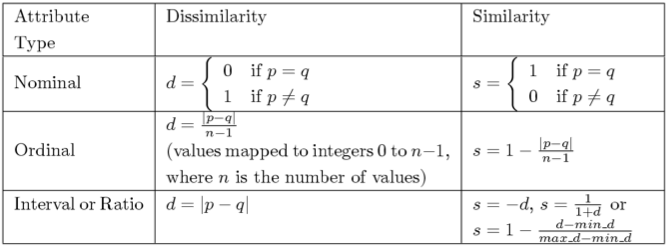

# Data Mining
## Chapter 1: Data Mining
### Definitions
#### What is Data?
Collection of data **objects** (rows) and their **attributes** (columns). Attributs can be mapped to different attribute values (e.g. different units).

#### Types of Attributes
* **Nominal**
	* Meaningless, to tell objects from another. (ID numbers, eye color, zip codes)
	* Properties: distinct (=, ≠)
* **Ordinal**
	* **Order** has meaning. (Rankings, grades, height in {tall, medium, short}
	* Properties: distinct (=, ≠), order (<, >)
* **Interval**
	* **Difference** has meaning. (Calendar dates, temperatures)
	* Properties: distinct (=, ≠), order (<, >), addition (+, -)
* **Ratio**
	* **Ratio** has meaning. (Lenth, time, counts, temperature in Kelvin)
	* Properties: distinct (=, ≠), order (<, >), addition (+, -), multiplication (*, /)
* Discrete Attribute
	* Finite or countably infinite set of values (Zip codes, counts, set of words in a collection)
	* Often as integers
* Continuous Attribute
	* Real numbers as attribute values (Temperature, height, weight)
	* Practically only measured and represented using finite number of digits
	* Often als floating-point

#### Types of data sets
* **Record**
	* Data Matrix (fixed set of numeric attributes, objects as points in multi-dimensional space)
	* Document Data (term vector, storing the number of times a word occurs)
	* Transaction Data (each record involves a set of items, e.g. grocery store)
* **Graph**
	* WWWW, Social Networks, Molecular Structures
* **Ordered**
	* Spatial Data, Temporal Data, Sequential Data, Genetic Sequence Data

#### Key Characteristics of Structured Data
* **Dimensionality**
	* Number of dimensions/attributs
* **Sparsity**
	* Number of *non-zero* values, sparse or dense
* **Resolution**
	* Properties and pattern depend on the level of resolution

#### Data Quality
##### Noise
Modification of original values through faulty data collection instruments, data transmission problems, technology limitations, inconsistency in naming convention.

##### Outlier
Objects with characteristics that are **considerably different** than most of the other data objects.

##### Missing Values
Due to equipment malfunction, information was not collected.

##### Duplicate Data
Issue when merging heterogeous sources, avoid accidentally combining similar but different objects.

### Data Preprocessing
#### Data Cleaning
* Handle **missing values**
	* Eliminate data objects or attributes (usually for missing class labels, only few objects)
	* Fill in the missing value manually
	* Fill in automatically (global constant, attribute mean, or most probably value)
* Identifiy **outliers** & Smooth out **noisy data**
	* Binning (first equal-frequency bins, then smooth by bin means, smooth by bin median, smooth by bin boundaries)
	* Regression (by fitting data into regression functions)
	* Clustering
	* Combined computer and human inspection
* Correct inconsistent data
* Resolve redundancy
* Aggregation (reduces amount of data, more *stable* data)
* Sampling (data selection)
	* Collecting/Processing the entire set of data is to expensive
	* Simple Random Sampling
	* Sampling without replacement (remove item from population after selection)
	* Sampling with replacement (same object can be picked up more than once)
	* Stratified sampling (data into partitions, random samples from each)
	* Gets harder for higher dimensionality!
* **Dimensionality Reduction**
	* Transform the x into p new variables y that are uncorrelated
	* Find the eigenvectors of covariance matrix
* **Subset Selection**
	* Redundant features (purchase price & sales tax paid)
	* Irrelevant features
	* Brute Force (try all possible subsets), Embedded approaches (naturally as part of process), Filter approaches (before DM algorithm runs), Wrapper approaches (DM algorithm as black box)
* **Feature Creation**
	* Mapping Data to New Space
	* Binarization (Map `m` categorical values into `[0, m-1]`, then covert to binary with `n = log_2(m)` digits
	* Discretization (How many split points and where to place them?)
* **Normalization**
	* Min-max normalization (e.g. [12,000, 98,000] -> [0,1], (73,000-12,000)/(98,000-12,000))
	* Z-score normalization `v' = (v - mean)/stdev`
	* Decimal Scaling `v' = v / 10^j`
#### Similatory
**Similatiry** (often in [0,1]) & **Dissimilarity** (minimum is often 0).

