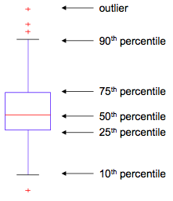

# Data Mining
## Chapter 3: Data Analytics
### Motivation
* Helping to select the right tool for preprocessing or analysis
* Using humans' abilities to recognize patterns
* **Exploratory Data Analysis**
	* John Tukey
	* Focus on visualization
	* Clustering and anomaly detection as exploratory techniques (in DM, they are major areas of interest instead)
### Summary Statistics
##### Frequency
Percentage of time a value occurs in the data set. (E.g. "male" and "female" occur about 50% of the time).

##### Mode
The most frequent attribute value.

##### Percentiles
For **ordinal** or **continuous** attributs, the p-th percentile Xp% is a value, such that p% of values of X are less than Xp%.

##### Mean
Most common measure of the location of a set of points.

##### Median
Not so sensitive to outliers, "middle" value.

##### Range
Difference between the max and min.

### Visualization
#### Motivation
* Humans are able to analyze large amounts of information that is represented visually
* Can detect general patterns and trends
* Can detect outliers and unusual patterns

##### Representation
Mapping of information to a visual format, such as points, lines, shapes or colors.

##### Arrangement
Placement of visual elements withn a display, can make large difference in how easy it is to understand the data.

##### Selection
Elimination or **de-emphasis** of certain objects and attributes. Subset of attributes (typically pairs are considered, reduction to 2-3 dimensions), or subset of objects.

#### Visualization Techniques
##### Histograms
* Divide values into bins and show bar plot of number of objects per bin
* Also two-dimensional to detect covariations

##### Box Plots

##### Scatter Plots
* Attributes determine the position
* Additional attributes through size, shape and color
* Array of scatter plots to compare several pairs of attributes

[!03_scatter_plot_array](img/03_scatter_plot_array.png)

##### Contour Plots
* Partition continuous data into regions of similar values
* Typically on maps

##### Matrix Plots
* When objects are sorted according to class (attributes normalized)
* Also plots of similarity or distance matrices

##### Parallel Coordinates
* Each object represented as a line between parallel axes
* Ordering of attributes is important

##### Others
* Star Plots
* Chernoff Faces

### Data Warehouse
**Subject-oriented**, **integrated**, **time-variant** and **nonvolatile** collection of data in support of management's decision making process.

* Subject Oriented: Organized around major subjects (customer, supplier, product, sales...)
* Integrated: Multiple heterogeneous sources
* Time-variant: Each structure contains element of time
* Nonvolatile: physically seperated store of data, only initial loading and access is provided

* Construction: Data cleaning, data integration, data consolidation
* Utilization: A collection of decision support technologies, e.g. On-Line Analytical Processing

#### Why DW'ing?
* Traditional DB Method: **Query-Driven**
	* Performs **On-Line Transaction Processing** **OLTP** for day-to-day operations
* Data Warehousing Method: **Update-Driven**
	* Serves knowledge workers by organizing and presenting data in different formats using On-Line Analytics Processing **OLAP**

### On-Line Analytical Processing
* Uses multidimensional array representation instead of tables
* Created in two steps:
	* Identify input dimension attributes (descrete values) and target attribute (typically counnt oder continuous)
	* Find the value of each entry by summing the values or counting all objects with the same attribute
* **Data Cube Measure**: numerical function for each point in the data cube space

#### Categories of Measures
* **Distributive**
	* Can be computed in a distributed manner (and then combined) -> efficient
	* Count, sum, min, max
* **Algrebraic**
	* If there are M arguments of the function, which all are distributive, then the function is algebraic
	* avg (sum/count), min_n, max_n, standard_deviation
* **Holistic**
	* Not possible to divide task to a constant M number of subtasks
	* median, mode, rank

#### OLAP Operations
* User-friendly environment for interactive data analysis
	* Reducing or increasing number of dimensions
	* Climbing up or down the concept hierarchy of abstraction levels
* **Roll-up**
	* Performs aggregation on data cube by climbing up concept hierarchy or reducing dimensions
	* Go from day -> week -> month, store -> city -> country
* **Drill-down**
	* Get more detailed data, introduce new dimensions
	* Go from year -> month -> week, continent -> country -> state -> city
* **Slicing**
	* Selecting a group of cells from entire multidimensional array by one or more dimensions
* **Dicing**
	* Defining a subarray by specifying a range of attribute values

### Design of DW
* **Top-down view**: Selection of relevant info for DW
* **Data spurce view**: Exposes the information being captured, stored and managed by operational systems
* **Data warehouse view**: Fact tables and dimension tables
* **Business query view**: Perspectives of data in DW from end-user view

#### Approaches
* **Top-Down**: Start with overall design (requires maturity)
* **Bottom-Up**: Start with prototypes (good for early stage of business)
* **Combined**
* **Software Engineering approaches**: Waterfall, Spiral

#### Multi-Tier Architecture
* **Bottom Tier**: Warehouse Database Server (extraction, cleaning, transformation, load, refresh)
* **Middle Tier**: OLAP Server
	* Relational OLAP model (e.g. DSS server of Microstrategy)
		* Optimization for each DBMS back end
		* Implementation of aggregation navigation logic
	* Multidimensional OLAP model
		* Multidimensional views to data cube array structures
		* Fast indexing but low storage utilization
	* Hybrid OLAP (e.g. MS SQL Server 2000)
		* Combines the 2, has greater scalability from ROLAP and faster from MOLAP
	* Specialized SQL servers
* **Top Tier**: Front-end Client Server (Query and reporting, analysis)

### Drom DW to DM
* **Information Processing**
	* Simple queries, statistical analysis, reporting
* **Analytical Processing**
	* Supports OLAP, multidimensional analysis, but can't extract patterns
* **Data Mining**
	* Supports KDD by finding patterns and Associations

### Benefits from DW
* Clean Data
* Information processing infrastructure
* OLAP at different levels of abstraction
* Online selection of data mining functions (compare Algorithms)