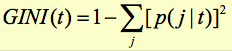
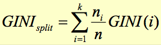
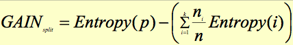
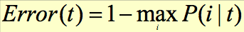

# Data Mining
## Chapter 4: Classification
### Definition and Basic Concepts
Given a collection of records (**training set**), find a **model** for class attribute to assign class to previously unseen records as accurately as possible. Test accuracy on a **test set**.

Predicting tumor cells as benign or alignant, classifying credit card transactions as legitimate or fraudulent...

### Classification Techniques
#### Decision Tree
Advantages:

* Inexpensive to construct
* Extremely fast for unknown records
* Easy to interpret for small-sized trees

##### Hunt's Algorithm for Decision Tree Induction
* Build tree starting with one attribute
* When results of one path are of same class, end that path. Continue the other path with next attribute

##### Greedy Stategy
* Split the records based on an attribute test that optimizes certain criterion.
* **Multi-way split**: Use as many partitions as distinct values
* **Binary split**: Divide values into two subsets, need to find optimal partitioning
* **Continuous Attributes**: Different ways of handling
	* Discretization for form an ordinal categorical attribute
	* Binary Decision (A < v or A >= v)
* Determine the Best Split: Nodes with **homogeneous** class distribution are preferred -> measure node impurity
* **GINI**: Min = 0.0, Max = 1-1/Nc.
	* 
	* 
	* For Contiuous Attributs:
		* Sort by attribute, generate split positions
		* For each split position compute GINI index
		* Choose the position with the least GINI index
* **Entropy**: Min = 0.0, Max = ld(Nc)
	* 
	* 
	* Con: Tends to prefere more partitions, each being small but pure
* **Classification Error**: Min = 0.0, Max = 1-1/Nc
	* 
* When to stop?
	* Stop expanding a node when all record have same class
	* ... when all the records have similar attribute values
	* early termination

#### Rule-Based Classifier
Classify by "if then" rules. `(Blood Type = Warm) && (Lay Eggs = Yes) -> Birds`

* A rule **covers** an instance, if attributes of instance satisfy the conditions
* **Coverage** of Rule `r: A -> y` in a dataset D: `coverage(r) = |A| / |D|`
* **Accuracy**: `accuracy(r) = |A ∩ y| / |A|`
* **Mutually exclusive** (No two rules are triggered by same record!)
* **Exhaustive** (Each record is covered by at least one rule)
* Rules generated from Decision Trees are both mutually exclusive and exhaustive
* Rules can be simplified
* Ordered Rule Set = **Decision List**