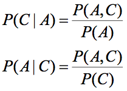
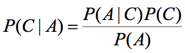
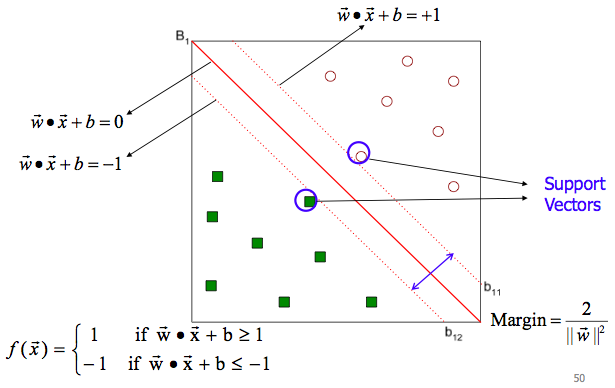
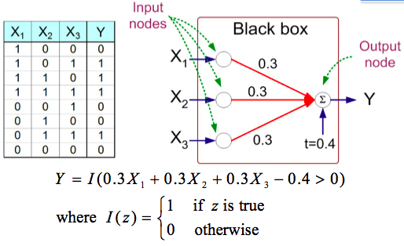

# Data Mining
## Chapter 5: Classification II
### Practical Issues of Classification
#### Underfitting and Overfitting
* **Underfitting**: When model is too simple, both training and test errors are too large.
* **Overfitting**: Results in decision trees that are more complex than necessary, training error has no estimation for unseen records!
* **Re-substitution errors**: Errors on training (sum e(t))
* **Generalization errors**: Errors on testing (sum e'(t))
* Methods for estimating generalization errors:
	* Optimistic: e'(t) = e(t)
	* Pessimistic: e'(t) = e(t) + N * 0.5 (N: number of leaf nodes)
	* Reduced error pruning: Uses validation data set

#### Occam's Razor
* Between 2 models of similar generalization errors, prefer the simpler model
* Complex model has greater chance that it was fitted accidentally by errors in data
* Minimum Description Length (**MDL**)
	* Cost(Model, Data) = Cost(Data | Model) + Cost(Model)
	* Cost = Number of bits needed for encoding
	* Cost(Data | Model) encodes misclassification error
	* Cost(Model) uses node encoding (# of children) + splitting condition encoding

#### How to Adress Overfitting
* **Pre-Pruning** (Early Stopping Rule)
	* Stop before it becomes a fully-grown tree
	* Typicall: Stop if all instances belong to same class; if all attributes are the same
	* More restrictive: Stop if # of Instances is < threshold; if there is no impurity improvements (GINI); if class distribution of instances is independent of the available features (X² test)
* **Post-Pruning**
	* Trim nodes in bottom-up fashion if e' improves
	* Use class label from majority of instances in sub-tree

#### How to Handle Missing Values
* Computing Impurity Measure
* Distribute Instances: Assign record to left child with weight Xl and to right child with weight Xr; X = probability of class in respective node
* CLassify Instances: Look at *mode* of attribute

### Instance-Based Classifiers
* Store training records without explicit models
* Use training records directly to predict class label of unseen cases
* **Rote-learner**: Memorize entire set, classify if exact attribute match
* **k-Nearest Neighbors** (k-NN): use k "closest" points for classification
	* 1 nearest-neighbor: Voronoi Diagram (Boundaries between neighborhoods)
	* n nearest: Weight the class vote according to distance: w = 1/d²
	* Pros: easy to implement, incremental addition
	* Cons: Lazy learners, no explicit model -> more expensive, no global model

### Bayesian Classifiers

* Pros:
	* Robust to isolated noise
	* Handle missing values by ignoring the instance
	* Robust to irrelevant attributes
* Cons
	* Independence assumption may not hold for some attributes
	* Other techniques like Bayesian Belief Networks (BBN)

### Support Vector Machines (SVM)
* Find linear hyperplane (decision boundary) that will separate the data
* Finy hyperplane **maximizing** the margin from the line
* 
* Soft Margin SVM: Maximixing the margin and **minimizing** the classification training error

### Artificial Neural Networks (ANN)
* Model is assembly of interconnected nodes and weighted links
* Output sums up input values according to weights of its links
* Compare output against threshold t
* 
* Learning ANN:
	* Initialize weights
	* Adjust weights so that output is consistent with class labels of traning examples

### Ensemble Classifiers
* Construct a set of classifiers from the training data
* Predict class label by aggregating proedctions made by multiple classifiers
* **Bagging**: Sampling with replacement, each sample has probablility of (1-1/n)^n of being selected
	* Pros: Decrease variance, improve stability, can be parallelized
	* Cons: Reduce accuracy for stable classifiers, because sample size is reduced by 36%
* **Boosting**: Iterative procedure, adaptively change distribution of training data by focusing on previously misclassified records (smapling weights change at end of boosting round for wrongly classified records, decrease for correctly classified records)