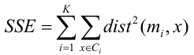
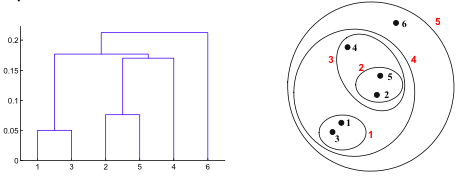

# Data Mining
## Chapter 6: Cluster Analysis
### Definitions
Finding groups of objects with minimized intra-cluster distances and maximized inter-cluster distances.

* Understanding of Data
* Summarization: Reduce large data sets

#### Clusterings
* Set of clusters
* **Partitional**:
	* Non-overlapping subsets (cluster), each object in exactly one subset
* **Hierarchical**:
	* Set of nested clusters organized as a hierarchical tree
* Exclusive vs. non-exclusive
	* Points belong to multiple clusters?
	* Can represent multiple classes or border points
* Fuzzy vs. non-fuzzy
	* Point belongs to every cluster with weight [0,1], total sum = 1
* Partial vs. complete
	* Only some of the data is clustered
* Heterogeneous vs. homogeneous
	* Different sizes, shapes and densities of cluster

### Types of Clusters
#### Well-separated clusters
Any point in a cluster is **closer to every other point in the cluster** than to any point outside.

#### Center-based clusters
Any point in a cluster is **closer to the center** of the cluster, than to the center of any other cluster. Center is called *centroid* (the average point) or *medoid* (the most representative point).

#### Contiguous clusters
Any point in a cluster is **closer to one or more other points in the cluster** than to any point not in the cluster.

#### Density-based clusters
A cluster is a dense region of points which is sepaated by low-density regions. (When clusters are irregular and when noise and outlier are present)

#### Property or Conceptual
Finds clusters that share some comming property or represent a particular concept. (e.g. circles)

#### Described by Objective Function
Finds clusters to minimize or maximize an objective function. (NP-Hard)

* Global Objectives (usually Partitional algorithms)
* Local Objectives (usually Hierarchical algorithms)
* Map clustering problem to different domain and solve it there
	* Promiximity matrix -> weighted graph
	* Breaking graph into connected components
	* Minimize edge weights between clusters, maximize within clusters

#### Characteristics of Input Data
* Type of proximity or density measure
* Sparseness
* Attribute type
* Type of Data
* Dimensionality
* Noise and Outliers
* Type of Distribution

### K-means Clustering
* Select K points as initial centroids (randomly)
* repeat until centroids don't change
	* Form K clusters bei assigning all points to the closest centroid
	* Recompute the centroid of each cluster

* Komplexity: `O(n*K*I*d)` (n = |Points|, K = |Clusters|, I = |Iteratrions|, d = |attributes|)

#### Evaluationg K-means Clusters
* Minimize Sum of Squared Error (SSE)
* Error: distance to the nearest cluster for each point
* 
* Good clustering with small K can have lower SSE than a poor clustering with higher K
* K should be higher then the number of real clusters (otherwise probability for selecting an initial point in each cluster is very low)
	* Sample and use hierarchical clustering
	* More then k initial centroids
	* Postprocessing

#### Handling Empty Clusters
* Choose point that contributes most to SSE
* Choose point from the cluster with highest SSE
* Update Centers Incrementally after each assignment to cluster

#### Limitations of K-means
* Problems with clusters of different size, density, non globular shape
* Problems when data contains outliers

### Hierarchical Clustering
* 
* No assumed particular number of clusters (any number can be obtained by cutting the dendogram at propper level)
* May respond to meaningful taxonomies

#### Agglomerative Clustering Algorithm
* Compute proximity matrix
* Let each data point be a cluster
* Repeat until only a single cluster remains
	* Merge the two closest clusters
	* Update proximity matrix

* Inter-Cluster Similarity:
	* MIN (determined by one link in the proximity graph)
		* Can handle non-elliptical shapes
		* Senstivie to noise and outliers
	* MAX
		* Less susceptible to noise and outliers
		* Tends to break lage clusters, biased towars globular clusters
	* Group Similarity
		* Less susceptible to noise and outliers
		* Biased towards globular clusters
	* Distance Between Centroids
	* Ward's Method
		* Similarity of two clusters based on increase in squared error when merged
		* Less susceptible to noise and outliers
		* Biased towards globular clusters
		
* `O(N^2)` in space for proximity matrix
* `O(N^3)` in time (N Steps which search/update matrix). `O(N^2 log(N))` for some approaches
