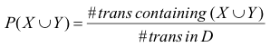
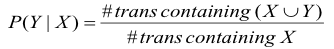
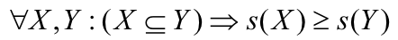
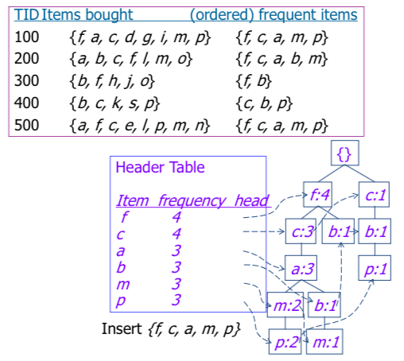
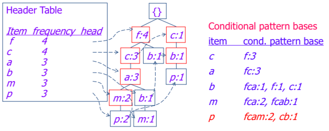
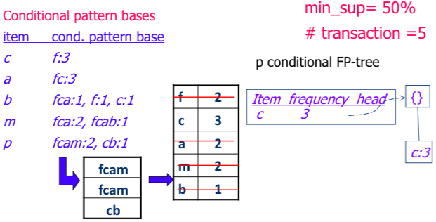
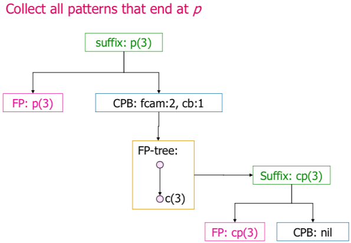

# Data Mining
## Chapter 8: Association Rule Mining
### Association Rules
Given a set of transactions, find rules that will predict the occurance of an item based on occurances of other items in the transaction.

* X -> Y, X ∩ Y = ∅
* **Support count (σ)**: Frequency of occurance of an itemset
* **Supports (s)**: Fraction of transactions that contain an itemset
	* 
* **Confidence (c)**: How often items in Y appear in transactions that contain X
	* 
* **Frequent Itemset**: Itemset with support > **min_sup** threshold
* Association rule is strong if: support ≥ min_sup, confidence ≥ min_conf

### Frequent Itemset Generation
Generate all itemsets with support ≥ min_sup.

#### Brute-force
Too expensive, `O(NMw), M = 2^d - 1` (d = number of unique items).

* Reduce number of Candidates (M) (pruning techniques)
* Reduce number of Transactions (N) (used by DHP and vertical-based mining algorithms)
* Reduce number of Comparisons (NM) (use effective data structures)

#### Apriori Principle
* If an itemset is frequent, then all of its subsets must also be frequent
* Any superset of an infrequent itemset must also be infrequent
* **Anti-Monotone** property of support
* 
* Example: When AB is infrequent, then ABC, ABD, ABE, ABCD, ABCDE... are too

Algorithm:

* Let k = 1
* Generate frequent itemsets of length 1
* Repeat until no new frequent itemsets are identified
	* Generate length k+1 candidate itemsets from length k frequent itemsets
	* Prune candidate itemsets containing subsets of length k that are infrequent
	* Eliminate infrequent candidates by scanning the DB

#### Complexity Factors of Apriori Algorithm
* Support Threshold (lower -> more frequent itemsets, higher number of candidates)
* Number of Items (higher -> more space needed, number of frequent items increases)
* Number of Transactions (higher -> run time increases because of multiple runs)
* Average Transaction Width (higher -> max length of frequent itemsets increases, more traversals of hash tree)

### Rule Generation
* Frequent itemset L: find all `f ⊂ L, f → L \ f` that satisfy the minimum confidence requirement
* `|L| = k ⇒ 2^k - 2` candidate association rules
* Confidence Rules do not have an anti-monotone property (`c(ABC → D) larger or smaller than c(AB → D)`)
* But have anti-monotone property when generated from same itemset: `c(ABC → D) ≥ c(AB → CD) ≥ c(A → BCD)`

* **Maximal Frequent Itemset**: An itemset is *maximal frequent* if none of its immediate supersets is frequent
* **Closed Itemset**: An itemset is *closed* if none of its immediate supersets has the same support as the itemset
* (Maximal Frequent Itemsets) ⊂ (Closed Frequent Itemsets) ⊂ (Frequent Itemsets)

#### FP-groth Algorithm
* **Frequent Pattern Tree**
* Avoid candidate generation, avoid multiple database scans
* Grow long patterns form short ones using local frequent items ("abc" freq -> get all transactions DB|abc. If "d" is local frequent in DB|abc, then `DB|abc → abcd` is frequent)

Construct:

1. Scan DB once, find frequent 1-itemsets (**min_sup**)
2. Order freq items in descending order (*L-order*)
3. Process DB based on L-order

* **Completeness**: Preseves complete DB information and counts
* **Comactness**: Tree never larger than original DB, no infrequent items

##### Mining Frequent Patterns Using FP-tree
1. Construct conditional pattern base **CPB** for each item in header table (go upward from item and write down path)
	* 
2. Construct conditional FP-tree from each conditional pattern-base
	* 
3. Recursively mine conditional FP-trees and grow frequent patterns obtained so far
	* 
	
* Pro: No candidate generation & test, compact data structure, eliminate repeated database scan
* Con: Support dependent, can't accommodate dynamic support threshold or incremental DB update