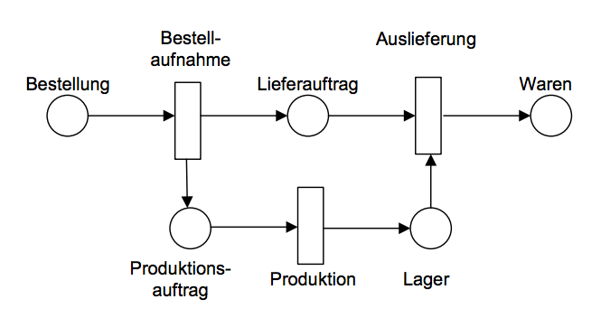
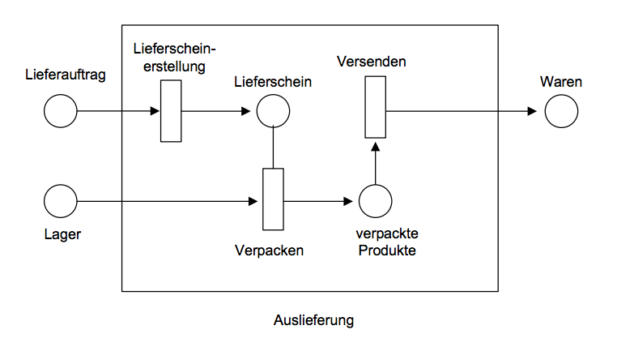
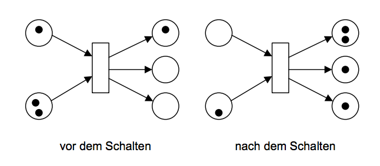
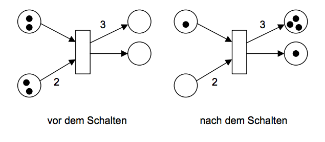
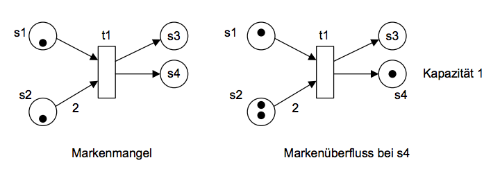
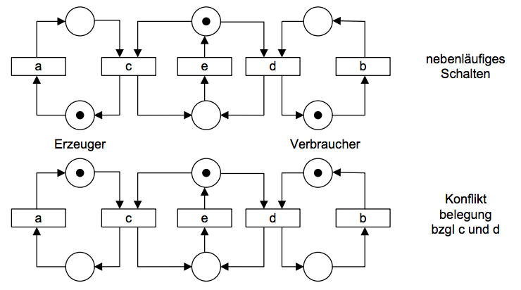
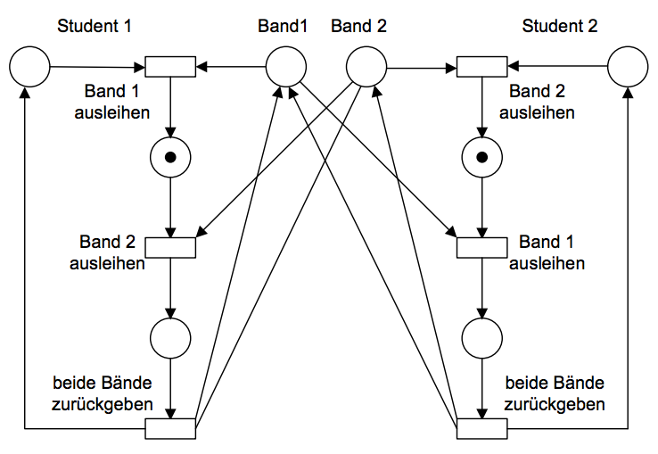
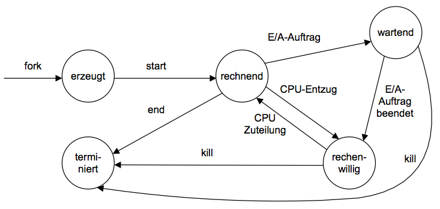
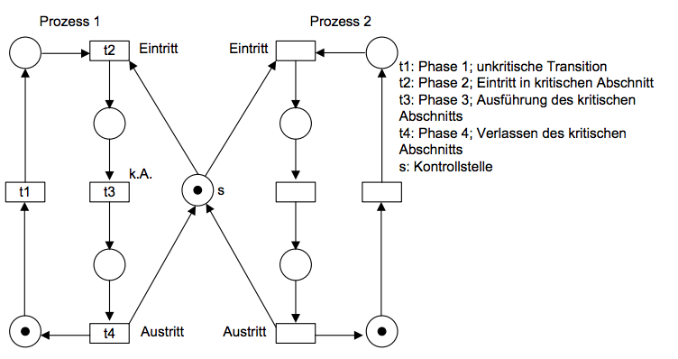

# Grundlagen Betriebssysteme
## Kapitel 3 - Parallele Systeme – Modellierung etc.
### Fragestellungen
* Sequentielle Aspekte
	* Programm = Algorithmus
	* Programm = Sequentielle Folge von Anweisungen
* Determinierte Programme (Unter gleichen Eingaben gleiche Ausgaben)
* Deterministische Programme (Eindeutig vorbestimmter Ablauf)
* Übergang von sequentiellen Systemen zu parallelen Systemen

### Beschreibungskonzepte
* Modell-basierte Konzepte (Ereignis-orientiert oder grafisch-orientiert)
* Sprachkonstrukte in Programmiersprachen (Java z.B. Threads)
* Konzepte in Betriebssystemen
	* Prozesskonzept
	* Threadkonzept
	* Kommunikation: Shared Memory, Dateien, Nachrichten
	* Synchronisation: Unterbrechungen, Sperren

### Modellierung paralleler Systeme
* Spezifikation von Verhalten
	* Abstraktion: Beschränkung auf interessierende Eigenschaften
* Nachweis von Eigenschaften (Determiniertheit, Störungsfreiheit, Wechselseitiger Ausschluss, Endloses Blockieren, Verhungern)
* Sicherheitseigenschaften
* Lebendigskeitseigenschaften

### Verhaltensbeschreibung
Beschreibung von Eigenschaften und deren Veränderungen über die Zeit. Duale Sichtweise aus *Aktionen* und *Ereignissen*.

**Ereignisspuren**: Folge von Ereignissen im zeitlichen Ablauf

**Zustandsspuren**: Folge von Zuständen im zeitlichen Ablauf

### Ereignisse und Aktionsstrukturen
**Prozess**: Tripel (E, ≤, α)

* Universum von Ereignissen E*
* Menge von Aktionen A
* Ereignismenge E ⊆ E*
* Kausalitätsrelation ≤ als partielle Ordnung über E
* Aktionsmarkierungen α zur Zuordnung von Ereignissen auf Aktionen

### Aktionen als Zustandsübergänge
Modell des Zustandsautomat mit Menge von **Zuständen S**, Menge von **Transitionsaktionen R**, Menge möglicher **Anfangszustände S0**

### Petri-Netze
* Graph mit Knoten und Kanten
* Knoten: Stellen (Kreis) und Transitionen (Rechteck)
* Kanten: S -> T oder T -> S
* Belegung der Stellen mit Marken (Token)
* Zustand: Belegung der Stellen
* Schaltregel: Abziehen und Hinzufügen von Token
* Markierung von Kanten

#### Beispiele




#### Schaltregel
* Markierung
	* Kapazität c
	* Gewichtung w
	* Markierung M
* Schaltregeln:



Mit Kantengewicht:



Nicht schaltbare Transition:



Nebenläufiges Schalten:



Deadlock beim Ausleihen von Büchern:



#### Eigenschaften
* **Lebendig**: Für jedes t gibt es eine erreichbare Markierung, in der t transitionsbereit ist
* **Vollständige Verklemmung**: Es gibt eine erreichbare Markierung, in der kein t schalten kann
* **Lokale Verklemmung**: Es gibt keine erreichbare Markierung, in der t schalten kann
* **Verklemmungsfrei**: Anfangsmarkierung lebendig?
* **Fairness**: Das Netz ist unfair für t, wenn es eine unendliche Sequenz gibt, in der t nur endlich oft auftritt, obwohl t unendlich oft transitionsbereit ist
* **Verhungern**: Es gibt eine unendliche Sequenz, in der t niemals auftritt

### Thread Konzept
**Prozessbestandteile**: Adressraum (idR virtueller Adressraum), Handlungsvorschrift (Programmcode), ein oder mehrere Aktivitätsträger.

> Thread = leichtgewichtiger Prozess

Bsp. Web-Server: *Verteiler*- und *Server*-Threads

**Rückgabewerte** direkt über geteilte Variablen (eventuell Fehleranfällig) oder indirekt über **Callback-Funktionen**.

### Synchronisation
> Abstimmen des zeitlichen Verhaltens nebenläufiger Aktivitäten untereinander

Zustände von Prozessen:



#### Wechselseitiger Ausschluss (WA)
Petrinetz mit Anfangsmarkierung M0. Wenn 2 Transitionen t1 und t2 wechselseitig ausgeschlossen sind, dann ist keine Markierung M' erreichbar, so dass t1 und t2 gleichzeitig schaltbereit sind. Derartige Transitionen heißen *kritische Abschnitte*.



**Anforderungen** an eine Lösung des WA:

* Die kA sind wechselseitig ausgeschlossen
* Realisierung darf nicht von der Reihenfolge der Ausführung der kA abhängen
* Realisierung darf nicht von Annahmen über die Ausführungszeit abhängen
* Kein Prozess darf undendlich lange daran gehindert werden, seinen kA auszuführen

**Lösung des WA**: Semaphore (Dijkstra 1968)
* Initialisierung
* Prolog (protekt) - atomar!
* Epilog (vrej) - atomar!

In C:

```c
pthread_mutex_init(mutex);
// ...
pthread_lock(mutex);
// ...
pthread_unlock(mutex);
```

**Lösung des WA**: Monitor
Methoden sind wechselseitig ausgeschlossen (weniger Programmierfehler). Prozess wird *wartend* gesetzt (cond.wait()) und wieder aktiviert (cond.signal()). Bsp. Java: **synchronized**.

### Verklemmungen – Maßnahmen
#### Ignorieren
Vogel-Strauß-Politik

#### Erkennen von Verklemmungen
Algorithmen dazu. Konsequenz: Abbruch von Prozessen

#### Verhindern von Verklemmungen
* Geordnete BM-Anforderung
* Globale BM-Zuteilung
* Abschnittsweise BM-Zuteilung

#### Vermeidung von Verklemmungen: Bankiers-Algorithmus
Bank, Kunde, Kreditlinie für jeden Kunden.

Aufgabe des Bankier: Vergabe von Krediten, Liquidität anhand von Heuristik. Grobes Vorgehen:

1. Kundin fordert an
2. Überprüfung der maximalen Anforderungen
3. Zuteilung, wenn passend

Beispiel:

| Kunde | aktueller Kredit | max Kredit |
|-------|------------------|------------|
| A     | 1                | 6          |
| B     | 1                | 5          |
| C     | 1                | 4          |
| D     | 4	               | 7          |

Die Bank hat noch 3 Einheiten zur Verfügung.

Annahme: C fordert noch 1 Einheit. Simulation der Anforderung zeigt, dass danach noch genug Einheiten vorhanden sind, um mindestens einen Kunden (C) bis zum Kreditrahmen zu bedienen. Zahlt C dann zurück, können B und D und dann schließlich A bedient werden.
