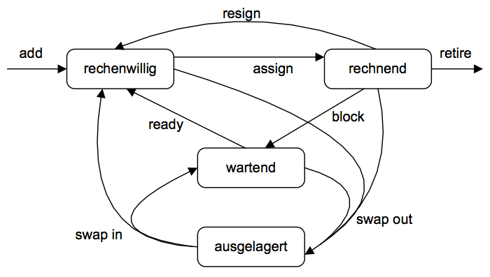

# Grundlagen Betriebssysteme
## Kapitel 4 - Prozess- und Prozessorverwaltung
**Dispatcher**: Zuteilung der CPU

**Scheduling**: Strategien zur Auswahl.

### Prozessverwaltung
Unterscheidung in Benutzerprozesse und Systemprozesse. Dienste der Prozessverwaltung:

* Erzeugen (siehe fork)
* Starten
* Terminieren
	* Freiwillig (normales Ende, selbst erkannter Fehler
	* Unfreiwillig (BS erkennt Fehler, Abbruch durch anderen Prozess)

#### Prozesskontrollblock (PCB)
Einträge in Prozesstabelle (beispielhaft):

* Name
* Benutzerzuordnung
* Prozesszustand mit zugeordneter CPU
* Ereignisse, auf die gewartet wird
* Priorität
* Registerinhalte
* PSW (Programstatuswort)

**Prozesslisten** verwalten die Prozesse eines jeweiligen Zustandes (z.b. Ready-Queue)

Prozesszustände und -übergänge:

#### Dispatcher
Realisierung der Zustandübergänge zwischen Rechnend und Rechenwillig -> Kontextwechsel. Sichert den Zustand des aktuell rechnenden Prozesses, lädt den Zustand des ausgewählten rechenwilligen Prozesses. Arbeitet im *Systemmodus*.

#### Realisierung von Threads
Entweder als *User Level Threads* oder *System Level Threads*:

**User Level Threads**: BS verwaltet nur single-threaded Prozese, Threads werden durch Laufzeitsysteme im Benutzeradressraum verwaltet.

**System Level Threads**: Thread Tabelle verwaltet Informationen über Threads, die Prozessorzuteilung erfolgt im BS Kern. Ein Systemaufruf eines Threads blockiert nicht die anderen Threads eines Prozesses.

### Scheduling
* Fairness
* Effizienz, Prozessorauslastung
* Antwortzeit (insb. bei Dialogverarbeitung)
* Wartezeit (insb. bei Stapelverarbeitung)
* Ausführungszeit
* Abschlusszeit (insb. bei Realverarbeitung)
* Durchsatz

#### Strategien
Unterbrechend/Nicht-unterbrechend, Mit/ohne Prioritäten, Mit/ohne Deadlines. Beispiele:

* Zeitscheiben (Round Robin, Quantum)
* Prioritätsstrategien (statische/dynamische Prioritäten)
* FCFS (First Come First Served)
* SJF (Shortest Job First)
	* SRPT (Shortest Remaining Processing Time)
* EFD (Earliest Deadline First), RMS (Rate Monotonic Scheduling)

#### Unterbrechungskonzept
**Ursachen** für Unterbrechungen:

* Zugeteilte Prozessorzeit aufgebraucht
* benötigte Ressourcen stehen nicht zur Verfügung
* I/O-Gerät meldet sich
* Fehler tritt auf
* Systemaufruf

**Unterbrechungsarten**:

* Synchron/Intern
	* Trap
	* Alarm
* Asynchron/Extern
	* Interrupt

**Behandlung externer Unterbrechungen**:
* Geräte-Controller meldet Unterbrechung über Interrupt-Leitung an CPU
* CPU prüft im Befehlszyklus nach jeder Befehlsausführung
* Liegt eine Unterbrechung vor:
	* Sichern des Zustands (PC, PSW)
	* Suche via Unterbrechungsnummer im Unterbrechungsvektor
	* Sprung zur Unterbrechungsanfangsbehandlung

**Konflikte**: GLeichzeitige Unterbrechungswünsche, geschachtelte Unterbrechungswünsche, Prioritäten der Unterbrechungen