# Grundlagen Betriebssysteme
## Kapitel 5 - Speicherverwaltung

### Einführung
Motivation: Unmittelbare Nutzung des Arbeitsspeichers nicht empfehlenswert -> Abstraktion, Umgang mit Kapazitätsengpässen

**Adressräume**: Maschinenadressraum (fortlaufend numerierte Bytes, start bei 0 (reale Adresse)), Programmadressraum (idR virtueller Adressraum, prozessspezifisch). Aufgabe der Abbildung der Adressräume: Adressierung (direkt-, basis-, seiten- segment-seiten-).

Trennung von Adressräumen: **Programmcode**, **Datenbereich** (statisch), **Heap** (Datenbereich dynamisch), **Stack** (Laufzeitkeller).

Single-Threaded Adressraum:

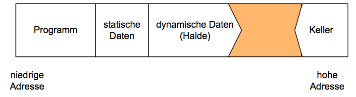

Multi-Threaded Adressraum:

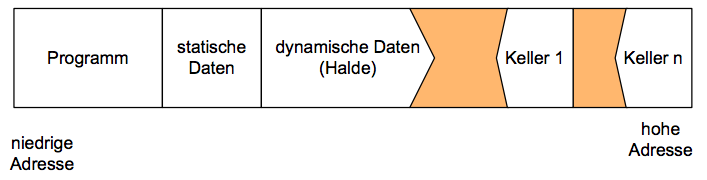

**Fragmentierung**: Zerstückelung des freien Teils des Adressraums

**Garbage Collection**: Speicherrepräsentation als Graph, markieren und freigeben nicht mehr erreichbarer Knoten

#### Anforderungen an Adressraumrealisierung
* Homogene und zusammenhängende Adressbereiche
* Unabhängig vom Arbeitsspeicher
* Erkennen fehlerhafter Zugriffe
* Erkennen von Überschneidungen (Heap und Stack)
* Schutz der Anwendungen gegeneinander
* Kontrollierbares und kontrolliertes Aufteilen der Speicherressourcen
* Minimale Fragmentierung

### Speicherabbildungen
#### Direkte Adressierung
Eine Programmadresse wird als Maschinenadresse implementiert. Nachteile:

* Lücken (Fragmentierung) nach programmende
* Programmgröße auf Arbeitsspeicher beschränkt
* Speicherausnutzung schlecht

#### Basisadressierung
Maschinenadresse = Basisadresse + Programmadresse

* Basisadresse ist Programmspezifisch
* Programmadressen starten mit 0
* Speicherverwaltugnsstrategien:
	* first-fit, next-fit, best-fit, worst-fit
	
### Seitenadressierung
* Prozessadressraum: Einteilung in Seiten (*pages*) gleicher Größe
* Maschinenadressraum
	* Einteilung in Kachenln (*frames*) gleicher Größe (idR wie Seitengröße)
* Seiten gespeichert im AS oder/und HS
* Zuordnung über Seitendeskriptoren in Seitent* abelle
* Einlagern nach Seitenfehler (*paging in*)
* Auslagern bei Platzbedarf (*paging out*)

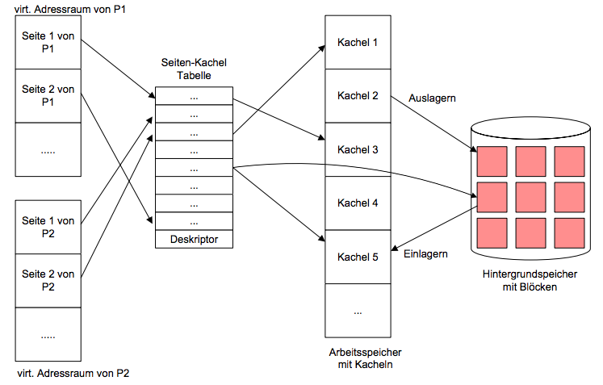

Vorteile:

* Verschiebkarkeit möglich
* Größenbeschränkung aufgehoben
* Teilweise Speicherung im AS möglich
* Differenzierter Zugriffsschutz möglich
* Gemeinsame Speicherbereiche möglich

**Virtuelle Adresse**: v = (s,w)

**Reale Adresse**: r = (p,w)

Zuordnung von Virtueller Adresse zu Realer Adresse durch die MMU (Memory Management Unit):

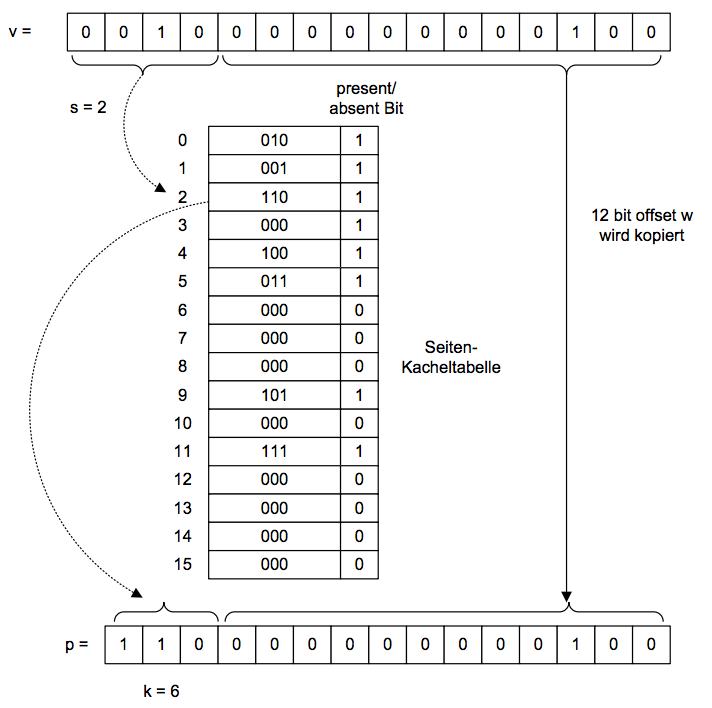

#### Seiten-Kacheltabelle
* Seitendeskriptor
	* Zugriffsrechte (rwq)
	* Existent-Attribut (e)
	* Geladen-Attribut (v)
	* Zugegriffen-Attribut (r)
	* Verändert-Attribut (m)
	* Seitenadresse (s als **Index**)
	* Kacheladresse	(Kachel k/p)
	* Hintergrundspeicheradresse (Block b)

#### Seitenfehlerbehandlung
* Seitenfehler
	1. Beim Zugriff auf eine virtuelle Adresse tritt ein Seitenfehler auf
	2. MMU löst Alarm aus
	3. BS stellt freie Kachel zur Verfügung
	4. Seite wird eingelagert
	5. Seitendeskriptor wird aktualisiert
	6. Der unterbrochene Befehl wird erneut gestartet
	
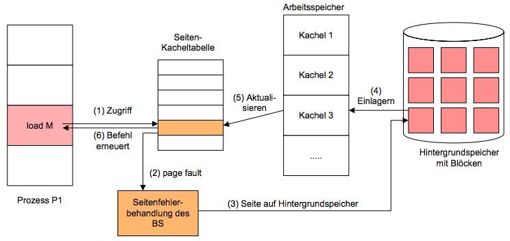

#### Seitenverwaltungsstrategien
**Ladestrategie**: Einzelanforderung, Prefetching

**Plazierungsstrategie**: Beliebige freie Kachel

**Seitenverdrängungsstrategie**:

* FIFO
* LRU (least recently used)
* Second Chance
* Clock Algorithmus:

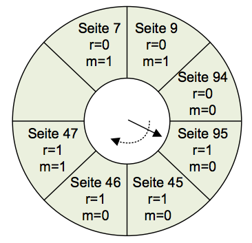

Adressierung in Linux über mehrstufige Seitentabelle, Seitengruppierung in aufeinanderfolgenden Seitenrahmen und modifiziertem Clock-Algorithmus mit 8-bit Zähler.

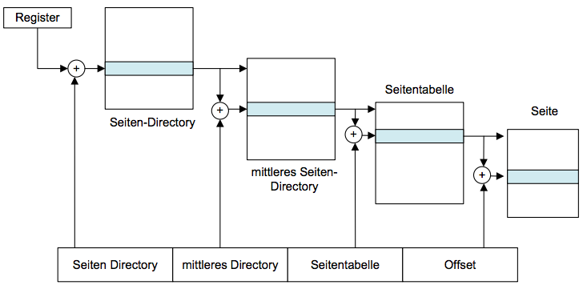

Zusätzlich: Unterteilung eines Programmspeichers in **Segemente** nach logischen Aufgaben (Code, Daten, Stack). Segmenttabelle pro Prozess und Erkennung von Segmenzugriffsfehlern.

### Caches
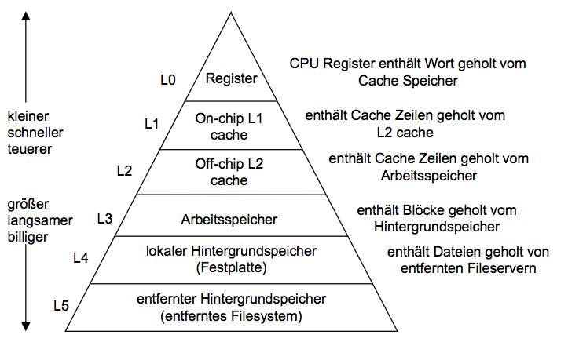

#### Cache Typen
| Cache Typ | Was? | Wo? | Kontrolle
| --------- | ---- | --- | ---------
| Register  | 4 Byte Wort | CPU Register | Compiler
| TLB       | Adress Translation | On-Chip TLB | Hardware
| L1 Cache  | 32 Byte Block | On-Chip L1 | Hardware
| L2 Cache  | 32 Byte Block | Off-Chip L2 | Hardware
| Virtual Memory | 4 KB Page | Arbeitsspeicher | Hardware
| Buffer cache | Teile von Dateien | Arbeitsspeicher | BS
| Network Buffer Cache | Teile von Dateien | lokale Platte | NFS Client
| Browser Cache | Web Seiten | lokale Platte | Web Browser
| Web Cache | Web Seiten | Server platte | Web Proxy Server

#### Realisierung von Caches
Cache ist ein Array von Mengen (S = Anzahl von Mengen), jede Menge enthält eine oder meherere Reihen (E = Anzahl von reihen pro Menge). Jede Menge enthält Datenblock (B ist Blockgröße pro Reihe). Cachegröße = B * E * S Bytes

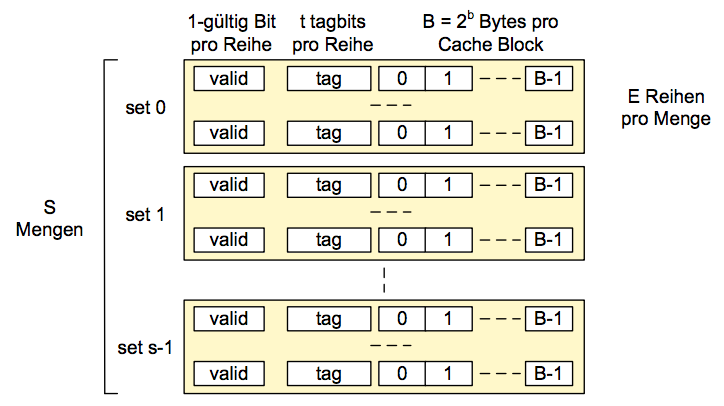

#### Adressierung von Caches
> Das Wort an Adresse A ist im Cache, falls die Tagbits einer der gültigen Reihen der Menge "set Index" den Tag "tag" besitzen. Der Wortinhalt beginnt am Offset "block offset" Bytes vom Blockanfang

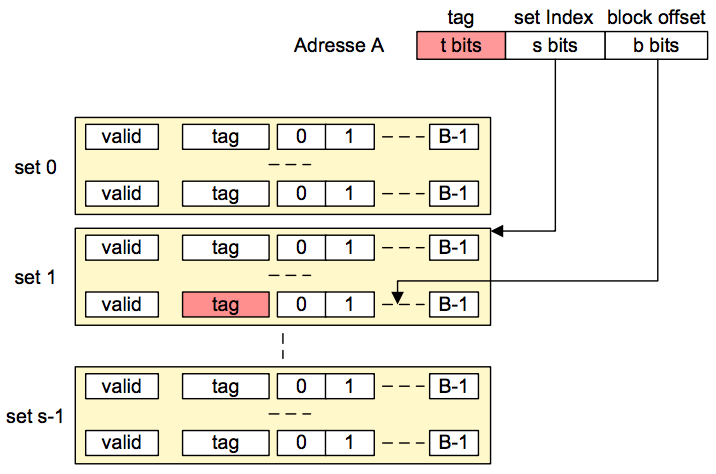

**Direct Mapped Cache**: Genau eine Reihe pro Menge, Zugriff in der Reihenfolge:

1. Mengenselektion: Benutzung der "set Index" bits zum Bestimmen der
relevanten Menge
2. Reihenabgleich: Finden der gültigen Reihe in der selektierten Menge mit
dem richtigen Tag
3. Wortselektion: Benutzung des block offsets zum Bestimmen des relevanten
Wortes.

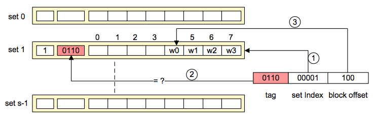

**Mengen Assoziativer Cache**: Mehr als eine Reihe pro Menge

1. Mengenselektion: Identisch zu direct-mapped Cache
2. Reihenabgleich: Vergleich der Tags für jede gültige Reihe in selektierter Menge
3. Wortselektion: Identisch zu direct-mapped Cache

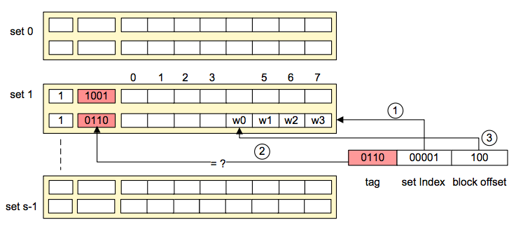