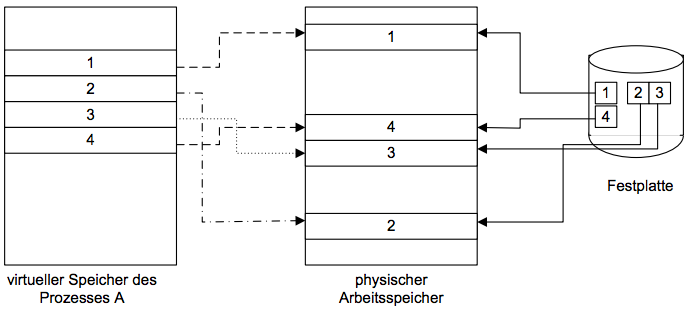
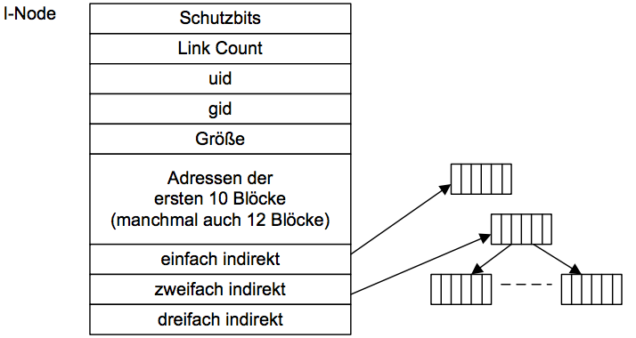

# Grundlagen Betriebssysteme
## Kapitel 7 - Dateisysteme
> Dauerhafte (persistente) Speicherung von Programmen, Daten etc. auf Medien (Festplatten, USB-Sticks), CD-ROM, DVD, Magnetbänder)

### Charakteristika von Dateisystemen
#### Datei
Behälter für die persistente Speicherung von Information, "bekannte, variabel lange Folge von Bytes". Strukturierte Namen mit Endung (Anwendungsspezifisch). Der Dateiaufbau ist abhängig von der Nutzung, meist ASCII Datei oder Archiv Datei.

Operationen auf Datien:
* öffnen, schließen
* lesen, schreiben
* kopieren, umbenennen, verschieben
* Verwaltung und Nutzung der Attribute

> Dateien sind *meist klein*, werden *häufig gelesen*, *seltener geschrieben* und *noch seltener gelöscht*. Vornehmlich im sequentiellen Zugriff und selten von mehreren Programmen gleichzeitig.

**Memory-Mapped Dateien**:
Speicherung im virtuellen Speicher, **Einblenden** in den virtuellen Adressraum:

#### Verzeichnisse
Spezielle Datei zur Strukturierung großer Dateimengen idR baumartig mit Links, absolute und relative Pfadnamen.

Operationen auf Verzeichnissen:
* create, delete
* opendir, closedir
* readdir
* rename
* link, unlink

### Schichtenmodell eines Dateisystems
#### Datenträgerorganisation
Blöcke und Blockadressierung: Verwaltung feier und defekter Blöcke:

Blockorientiertes Dateisystem:
* Verwaltung der gesamtmenge der Blöcke
* keine hierarchische Verzeichnisstruktur
* Datei = Menge von Blöcken
* Einfache Operationen (Erzeugen/Löschen, Öffnen/Schließen, Lesen/Schreiben)

Beispiel Dateiverwaltung: I-Nodes:

