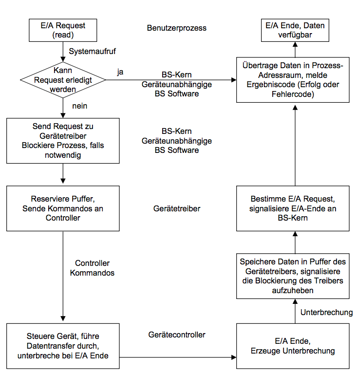
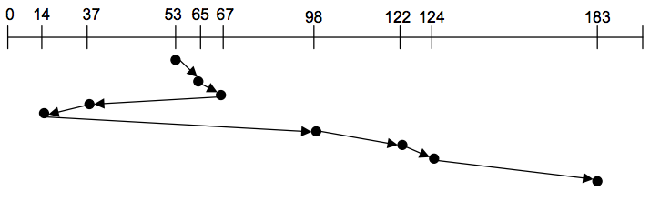
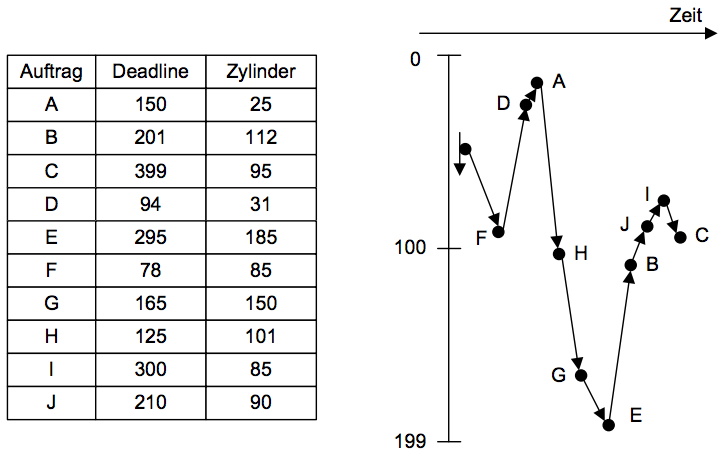

# Grundlagen Betriebssysteme
## Kapitel 8 - Ein-/Ausgabe
BS überwacht alle Ein-/Ausgabegeräte, E/A Software soll möglichst Geräteunabhängig sein.

Gliederung der Geräte:
* Übertragungseinheit:
	* Blockorientierte Geräte
	* Zeichenorientierte Geräte
* Gerätezugriff
	* Wahlfreier Zugriff
	* Serieller Zugriff

### Schichten eines E/A Systems
* Unterbrechungsroutinen (Handhabung von rückmeldungen),
* Gerätetreiber (Steuersoftware für alle Geräte eines Typs)
* Geräteunabhängige BS-Software (Belegen, Puffern)

Ablauf des Gerätezugriffs:

### Geräteverwaltung
Ziele:
* Einheitliche Darstellung der unterschiedlichen Geräte
* Zuordnung von logischen Kanälen zu physischen Geräten

Gerätetreiber bedienen die Hardware zur Gerätesteuerung. Aufgaben:
* Definition eines Gerätes
* Gerätespezifische Datenbasis
* Initialisierung des Geräts beim Start
* Umsetzung von E/A-Aufforderungen auf Gerätebefehle
* Antwort auf Gerätesignale
* Empfängt/sendet Daten vom/zum Gerät
* Ggf. Multiplexing und Multithreading
* Pufferung von Daten zur Ein- und Ausgabe

#### Geräteunabhängige E/A
Einbettung ins BS, z.b. `/dev/sd0` (Hautgerätenummer + Nebengerätenummer) und Pufferung.

Bereitstellen einheitlicher E/A Funktionen:
* open()
* close()
* read()
* write()
* ioctl()

### RAID & Disk Scheduling
> redundant Array of Inexpensive Disks

RAID Level:
* RAID Level 0: Verteilung der Abschnitte (Stripes) Round-Robin auf Platten
* RAID Level 1: Spiegelung der Platten
* RAID Level 2: Bit-Striping mit Parity Platten

#### Disk Scheduling
* FCFS (First Come First Served)
* SSFT (Shortest Seek Time First)
	* Beachtet den Abstand des Lesekopfs zur nächsten Position
* SCAN (Zum einen Plattenende (alles abarbeiten), dann zum anderen (und dabei alles abarbeiten))

Shortest Seek Time First:

### Multimedia Systeme
Populäre Anwendungen wie Audio- und Video-Clips, Live Webcasts stellen zeitliche Anforderungen von 24-30 Frames/Sekunde. Außerdem Lokales Playback und Streaming (Progressive Download vs. Real-time Streaming).

Kombination von Shortest Seek Time First und Earliest Deadline First (EDF):
* Aufträge nach ihrer Deadline Ordnen
* Gruppieren und Aufträge mit "selber" Deadline nach SCAN Reihenfolge abarbeiten
* Zeitbereiche von z.B. 100ms

