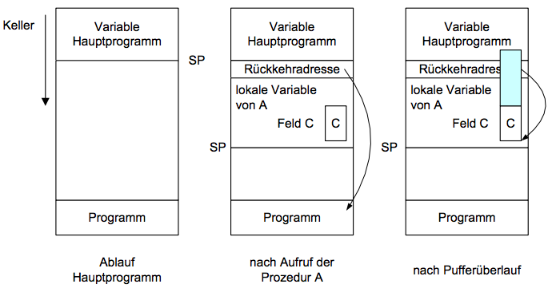
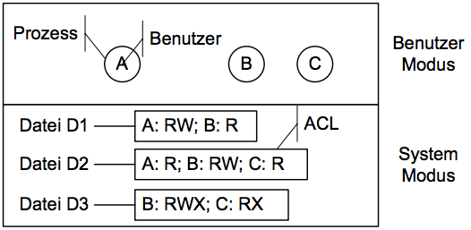
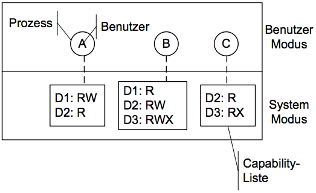

# Grundlagen Betriebssysteme
## Kapitel 9 - Sicherheit in Rechensystemen
**Jemanden** (Personen oder Gruppen) **davon abhalten** (durch technische oder organisatorische Maßnahmen), **einige** (begrenzt durch unser Vorstellungsvermögen) **unerwünschte Dinge zu tun** (nicht autorisierte Daten lesen/schreiben, unter "falscher Flagge" arbeiten, nicht autorisierte BM verbrauchen).

### Angriffe
#### Login-Attrape
Vorgeschaltene Maske, die einem anderen Benutzer die Eingabefunktion simuliert.

Lösung durch Start des Login-Dialogs durch nicht-erfassbare Tastenkombination (z.B. `CTRL+ALT+DEL`)

#### Virus
Code, der an ein anderes Programm angehängt ist und sich selbst reproduzieren und Schaden anrichten kann.

Z.B. Boot-Sector-Virus, Macro Virus, Auführbares Programm als Virus. Abhilfe: Anti-Viren-Programme.

#### Pufferüberlauf
Fehlerhafte Überprüfung der Einhaltung von Feldgrenzen bei Strings und deren Funktionen. Veränderung der Rücksprungadresse nach Analyse des Speicherlayouts und eventuell Ausnutzen von vorhandenen Root-Rechten.

### Schutzmechanismen
* Objekte eindeutig und fälschungssicher identifizierbar
* Benutzer eindeutig und fälschungssicher identifizierbar
* Objektzugriff nur über Objektverwaltung und nur, wenn Zugreifer die benötigten Rechte hat
* Rechte müssen fälschungssicher gespeichert werden
* Nur kontrollierte Weitergabe von Rechten
* Prinzip der minimalen Rechte
* Überprüfung der Mechanismen ohne großen Aufwand möglich

Ebenen des Zugriffsschutzes:
* Maschinenschutz (physischer Zugang)
* Zugangskontrolle (logischer Zugang)
* Berechtigungskontrolle (Zugriff auf Daten und Dienste)
* Systemschutz (Integrität, keine Modifikationen möglich, kein Umgehen und Aushebeln möglich)

#### Schutzmatrix
**Schutzdomäne**: Menge an (Objekt, Rechte)-Paaren

* Zuordnen eines Prozesses P zu einer Schutzdomöne
* P ist immer einer Domäne zugeordnet
* Wechsel der Zuordnung ist möglich
* Subjekt ist ein (Prozess P, Schutzdomäne D)-Paar

**Schutzmatrix**: Objekt-zu-Domäne Zuordnung

#### Schutzmatrix - Umsetzung
**Schutzmonitor**: Überprüfung der Zugriffe gemäß Matrix, Schutzmonitor ist vertrauenswürdig.

**Zugriffskontrollliste (Access Control List)**: Spaltenweise Speicherung der Schutzmatrix, jedes Objekt besitzt eine ACL.

**Capability-Liste (Zugriffsausweisliste)**: Zweilenweise Speicherung der Schutzmatrix, jeder Prozess besitzt eine Menge von Capabilities.

#### Authentifizierung
Grundlagen: Login-Name, Passwort

Einsatz eines **Streuwerts**: (gehashte) Passwort-Duplikate nicht erkennbar, erhöht Aufwand für Attaken auf die Passwort-Datei

### Mobile Code
Verbreitung von Code (Web-Seiten mit Applets, Agenten...).
* Sandboxing (Zugriff für Code auf Dateien eingeschränkt, überprüfen auf Sandbox-Konformität)
* Interpretation (Analyse vor Ausführung durch VM, Abfangen von Systembefehlen)
* Signed Code (Vertrauenswürdige Quellen, Einsatz digitaler Unterschriften)