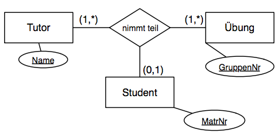
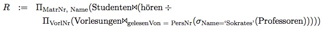
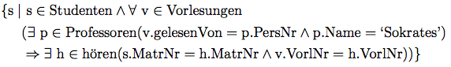
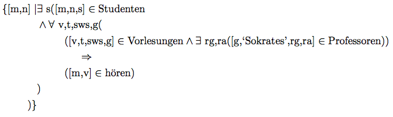
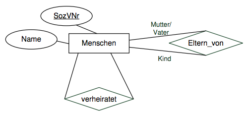

# Grundlagen Datenbanken
## 1. Einleitung
### Gründe/Argumente für Datenbanksysteme
1. Eigene Datenformate sind unflexibel, da kein Pfad zur Erweiterung, Verteilung, Recovery etc. exisitert
2. Einsatz eines Komplexen Produkts nicht notwendig, schlanke Versionen wie z.b. SQLite
3. Mehrbenutzersynchronisation kommt meist (wenn auch nachträglich), Datenbanksysteme haben dafür eine Lösung
4. Auch eigene Datenformate/APIs müssen erlernt werden, SQL ist stnadardisiert
5. Datenbanksysteme bieten kontrollierte Redundanz

### Relationales vs. Graphstrukturiertem Modell
**Relational**: Einsatz z.B. für ein CMS.

**Graphstrukturiert**: Dateinspeicherung in der Bioinformatik/Medizin, inhärent graphstrukturierte Daten wie U-Bahn Netze

## 2. Konzeptionelle Modellierung
### Konsitenzbedingungen
#### Funktionalitätsangaben


Bedeutet:
* `1` Tutor *nimm* an `1` Übung *teil*
* `M` Studenten *nehmen* an `1` Übung *teil*
* `1` Übung wird von `1` Tutor *geleitet*
* `1` Übung wird von `M` Studenten *besucht*

Es gelten die Partiellen Funktionen:
```
Tutor x Student --> Übung
Übung x Student --> Tutor
aber
Tutor x Übung -/-> Student
```
**Faustregel**: In FDs rechts stehende Relationen erhalten eine Funktionalität von `1`.

> Wie oft sind Entitäten einer Relation an einer Instanz der Beziehung beteiligt?

#### Min-Max Angaben
Modellierung folgender Einschränkungen im MinMax Modell:
* Ein Tutor hält mindestens eine Übung
* Eine Übung wird von mindestens einem Studenten besucht
* Ein Student kann höchstens eine Übung besuchen



Verbindung zu einer Realtionstabelle (im Beispiel mit `TutorName`, `GruppenNr` und `MatrNr`):
Jede Eintität kommt in der jeweiligen Spalte so oft vor, wie es die MinMax Notation vorschreibt.

> Wie oft darf eine Entität in einer Beziehungsrelation vorkommen?

## 4. Relationale Anfragesprache
### Relationale Algebra
#### `σ` - Selektion (Sigma)
Nimmt ein Prädikat und prüft jedes Tupel einzeln ob der Erfüllung des Prädikats.

#### `π` - Projektion (Pi)
Selektiert nur die im Subskript angegebenen Attributnamen. Hierdurch entstehende Duplikate werden eliminiert.

#### `ρ` - Umbenennung (Rho)
Umbenennen von Relationen. Zum Umbenennen von einzelnen Attributen: `ρ Voraussetzen <- Vorgänger (voraussetzen)`.

#### `∪` - Vereinigung
Relationen mit *gleichen Attributnamen und -typen* können zu einer Relation zusammengefasst werden.

#### `-` - Mengendifferenz
Für zwei Relationen mit gleichem Schema ist die Mengendifferenz `R - S` die Relation der Tupel, die in `R` aber nicht in `S` vorkommen.

#### `×` - Kathesisches Produkt
Kreuzprodukt zwischen zwei Relationen, enthält `|R| * |S|` Tupel.

#### `⨝`- Natural-Join
Kreuzprodukt zwischen zwei Relationen, wobei nur Paare behalten werden, die in *gleich benannten Attributen* **übereinstimmen**.

#### `⨝` - Allgemeiner Join
Wie *Natural-Join*, aber mit frei wählbarem Prädikat zur Verbindung von Tupeln.

#### `⟕` - Left Outer Join
Die Tupel der **linken** Argumentrelation bleiben auch ohne Gegenstück erhalten (führt zu Null-Werten)

#### `⟖` - Right Outer Join
Siehe *Left Outer Join*

#### `⟗` - (Full) Outer Join
Siehe *Left Outer Join*, aber es bleiben beide Seiten erhalten.

#### `⋊` - Left Semi Join
Es bleiben nur Tupel aus der **linken** Argumentrelation erhalten und nur, wenn sie ein Gegenstück finden.

#### `⋉` - Right Semi Join
Siehe *Left Semi Join*

#### `▷` - Anti Semi Join
Es bleiben nur Tupel aus der **linken** Argumentrelation erhalten, die **kein** Gegenstück finden. Definiert als `L ▷ R = L - (L ⋉ R)`

### Tupel-/Domänenkalkül
> Finden Sie alle Studenten, die alle Vorlesungen gehort haben, die von Sokrates gelesen
wurden.

#### Relationaler Algebra
1. Wir ermitteln alle von Sokrates gelesenen Vorlesungen
2. Durch Anwendung des Divisionsoperators bekommen wir die Matrikelnummern der Studenten, die alle von Sokrates gehaltenen Vorlesungen gehört haben
3. Aus Studenten ermitteln wir zusätzlich die Namen der Studenten



#### Tupelkalkül
1. Wie ermitteln mittels des **Allquantors** alle Vorlesungen, die von Sokrates gehört werden
2. Wir fordern, dass ein Student alle diese Vorlesungen gehört hat (**Implikation** und **Existenzquantor**)



#### Domänenkalkül
Vorgehen relativ analog zum relationalen Tupelkalkül

;

### SQL
#### Select
> Finden Sie alle Studenten, die Sokrates aus Vorlesungen kennen

```sql
SELECT DISTINCT s.*
FROM Vorlesungen v, Professoren p, Studenten s, hoeren h
WHERE p.name = 'Sokrates'
	AND v.gelesenVon = p.persNr
    AND v.vorlNr = h.vorlNr
    AND s.matrNr = h.matrNr
```

> Finden Sie die Studenten, die Vorlesungen horen, die auch Fichte hort.

```sql
SELECT s1.*
FROM Studenten s1, Studenten s2, hoeren h1, hoeren h2
WHERE s2.name = 'Fichte'
	AND s1.matrnr = h1.matrnr
	AND h1.vorlnr = h2.vorlnr
    AND h2.matrnr = s2.matrnr
	AND s1.matrnr != s2.matrnr
```

> Formulieren Sie eine SQL-Anfragen, um die Studenten zu ermitteln,
die mehr SWS belegt haben als der Durchschnitt. Berucksichtigen Sie dabei auch Total- 
verweigerer, die gar keine Vorlesungen horen.

```sql
-- calculate average sws by sum(all_taken_sws)/count(all_students)
WITH avg_sws as (SELECT sum(sws)*1.0/(SELECT count(matrnr) FROM Studenten) as avg_sws
		FROM hoeren h, Vorlesungen v
		WHERE h.vorlnr = v.vorlnr)
SELECT s.name, s.matrnr, avg(sws)
FROM Studenten s, hoeren h, Vorlesungen v
WHERE s.matrnr = h.matrnr
    AND h.vorlnr = v.vorlnr
    GROUP BY s.name, s.matrnr
    HAVING sum(sws) > (SELECT * FROM avg_sws)
```

> Bestimmen Sie fur alle Studenten eine gewichtete Durchschnittsnote ihrer Prüfungen. Die Gewichtung der einzelnen Prüfungen erfolgt gemäß dem Vorlesungsumfang (SWS).

```sql
-- pruefen relation mit gewichteter Note pro ergebnis
WITH noten as (
	SELECT s.*, v.sws as gewicht, p.note*v.sws*1.0 as note
	FROM Studenten s, pruefen p, Vorlesungen v
	WHERE s.matrnr = p.matrnr
	AND p.vorlnr = v.vorlnr
)
-- gruppierung nach Student
SELECT name, matrnr, sum(note)*1.0/sum(gewicht) as Durschnittsnote
FROM noten
GROUP BY name, matrnr
```
> Welche Studenten haben alle Vorlesungen, die sie haben prüfen lassen, auch tatsächlich
vorher gehört?

=> Die Anforderung lässt sich umschreiben zu "Es darf keine Vorlesung geben, die geprüft wurde, zu der es aber keinen Eintrag in `hoeren` gibt".

```sql
-- alle Studenten
SELECT * FROM Studenten s
WHERE NOT EXISTS (
	-- für die es keinen Eintrag in pruefen gibt,
	SELECT * FROM pruefen p
	WHERE p.matrnr = s.matrnr
	AND NOT EXISTS (
		-- der nicht durch einen Eintrag in höeren belegt wird
		SELECT * FROM hoeren h
		WHERE h.matrnr = s.matrnr
		AND h.vorlnr = p.vorlnr
	)
)
```

> Ermitteln Sie den Männeranteil an den verschiedenen Fakultäten in SQL!

```sql
WITH FakTotal AS (
	SELECT FakName, COUNT (*) as total
	FROM StudentenGF
	GROUP BY FakName),
FakMaenner AS (
	SELECT FakName, COUNT (*) as maenner
	FROM StudentenGF
	WHERE geschlecht = 'M'
	GROUP BY FakName)
SELECT FakTotal.FakName,
	(CASE WHEN maenner IS NULL THEN 0 ELSE maenner END)/(total*1.0)
FROM FakTotal
LEFT JOIN FakMaenner ON FakTotal.FakName = FakMaenner.FakName
```

#### Create


```sql
create table Menschen (
	SozVNr varchar (30) not null primary key ,
	Name varchar (30)
);
create table Eltern_von (
	MutterVater varchar (30) not null references Menschen,
	Kind varchar (30) not null references Menschen,
	primary key (MutterVater, Kind)
);
create table verheiratet (
	Ehegatte1 varchar (30) not null references Menschen on delete cascade,
	Ehegatte2 varchar (30) not null references Menschen on delete cascade,
	primary key (Ehegatte1),
	unique (Ehegatte2)
);
```

## 5. Datenintegrität
### Typensystem

### Schlüssel
#### Superschlüssel
`a ⊆ R` ist ein Superschlüssel, wenn gilt: `a -> R`

#### Kandidatenschlüssel
`a ⊆ R` ist ein Kandidatenschlüssel, wenn gilt: `a ->* R`

Dabei bedeutet `a ->* R`: `R` ist **voll funktional abhängig** von `a`, also `a -> R` und `a` **ist minimal** (kann nicht reduziert werden, ohne dass die Abhängigkeit von `R` verloren geht).

#### In SQL
* **Kandidatenschlüssel**: `unique`
* **Primärschlüssel**: `primary key`
* **Fremdschlüssel**: `foreign key`

### Trigger
Beispiel: Professoren können nut im Rang *raufgestuft* werden, aber nicht *heruntergestuft* (Oracle Syntax):

```sql
create trigger keine Degradierung
before update on Professoren
for each row
when (old.Rang is not null)
begin
	if :old.Rang = 'C3' and :new.Rang = 'C2' then
		:new.Rang := 'C3';
	end if;
	if :old.Rang = 'C4' then
		:new.Rang := 'C4'
	end if;
	if :new.Rang is null then
		:new.Rang := :old.Rang;
	end if;
end
```

### Check Constraints
Beispiele:

```sql
create table Studenten (
	-- ...
	Semester integer check Semester between 1 and 13
);
create table Professoren (
	-- ...
	Rang character(2) (Rang in ('C2', 'C3', 'C4'))
);
```

## 6. Relationale Entwurfstheorie
#### Attributhülle
Beispielrelation:
* A -> BC
* C -> DA
* E -> ABC
* F -> CD
* CD -> BEF

Attributhülle von **A**:

Schritt | betrachtete FD | Ergebnis
--------|----------------|---------
init    |                | {A}
1.      | A -> BC        | {A, B, C}
2.      | C -> DA        | {A, B, C, D}
3.      | CD -> BEF      | {A, B, C, D, E, F}

#### Kandidatenschlüssel
Im Beispiel: {A}, {C}, {E}, {F}

{A} ist ein Superschlüssel und außerdem minimal, also auch ein **Kandidatenschlüssel**. Da aus {C} und {E} direkt A folgt, sind es ebenso Superschlüssel und (da sie einelementig sind) auch Kandidatenschlüssel. Aus {F} kann C und somit A gefolgert werden, also ist {F} auch ein Kandidatenschlüssel.

{B} ist nicht einaml ein Superschlüssel, {C, D} wäre ein Superschlüssel aber nicht minimal und deswegen kein Kandidatenschlüssel.

#### Kannonische Überdeckung
1. Für jede FD *Linksreduktion* durchführen
2. Für jede (verbliebene) FD *Rechtsreduktion* durchführen
3. Ins leere zeigende FDs entfernen
4. Mit der Vereinigungsregel FDs zusammenfassen

Beispiel von oben:

1. Linksreduktion (Prüfe für jedes Attribut links, ob es überflüssig ist)

* A -> BC
* C -> DA
* E -> ABC
* F -> CD
* C -> BEF	(CD -> BEF, aber C führt schon auf D, also ist es links überflüssig)

2. Rechtsreduktion (Prüfe für jedes Attribut rechts, ob es durch die anderen Attriute rechts erreichbar wäre)

* A -> C	(A -> BC, aber C führt zu B, also ist B rechts überflüssig)
* C -> 0	(C -> DA, aber C -> BEF -> D, A, also sind beide rechts überflüssig)
* E -> A	(E -> ABC, aber A -> C -> B, also sind B, C rechts überflüssig)
* F -> CD	(nicht verändert, die Attribute können nicht mehr anders erreicht werden)
* C -> BEF	(nicht verändert, keins der Attribute kommt rechts noch einmal vor)

3. Ins leere zeigende FDs entfernen

* A -> C
* E -> A
* F -> CD
* C -> BEF

### Normalformen
#### 1. Normalform
* Nur Atomare Domänen (nicht "Arrays" als Werte für ein Feld)

#### 2. Normalform
* Jedes Nichtschlüssel-Attribut `a ⊆ R` muss **voll funktional abhängig** sein von jedem **Kandidatenschlüssel**

Gegenbeispiel:

*MatrNr* | *VorlNr* | Name | Semester
---------|----------|------|---------
26120    | 5001     | Fichte | 10
28106    | 5041     | Carnap | 3
28106    | 5216     | Carnap | 3

Es gelten `MatrNr -> Name` und `MatrNr -> Semester`, aber keine Abhängigkeit von `VorlNr`.

Dies führt zu *Einfügeanomalien* (Studenten, die keine Vorlesungen hören?) *Updateanomalien* (Carnap ins 4. Semester) und *Löschanomalien* (Wenn Fichte die letzte Vorlesung absagt?).

Lösung: Zerlegung in 2 Relationen: `hoeren: {[MatrNr, VorlNr]}` und `Studenten: {[MatrNr, Name, Semester]}`

#### 3. Normalform
Für jede FD der Form `a -> B` muss mindestens eine der 3 Bedingungen gelten:
* `B ∈ a` -  Die FD ist trivial
* Das Attribut `B` ist in einem Kandidatenschlüssel von `R` enthalten (B ist prim)
* `a` ist Superschlüssel von `R`

#### Boyce-Kott Normalform
Selbe Regeln wie bei 3. Normalform, außer dem 2. Also:
* `B ∈ a` -  Die FD ist trivial
* `a` ist Superschlüssel von `R`

Jede Realtion ist *verlustlos* in BCNF-Relationen *zerlegbar*, die *Abhängigkeitserhaltung* ist *nicht immer gewährleistet*.

### Synthesealgorithmus
Bringt ein Relationsschema mit funktionalen Abhängigkeiten in die **3. Normalform**, ist *verlustlos* und *abhängigkeitserhaltend*.

1. Bestimmung der kanonischen Überdeckung Fc zu F:
	1. Linksreduktion
	2. Rechtsreduktion
	3. Entfernung von FDs der Form `a -> 0`
	4. Zusammenfassung gleicher linker Seiten
2. Für jede funktionale Abhängigkeit `a -> b ∈ Fc`
	* Kreiere ein Relationenschema `Ra` aus den Attributen in `a` und `b`
	* Ordne `Ra` die FDs zu
3. Falls ein erzeugtes Schema einen Kandidatenschlüssel von R bzgl. Fc enthalt, sind wir fertig. Sonst wähle einen Kandidatenschlüssel aus R aus und erzeuge ein Schema mit dem Schlüssel.
4. Eliminiere diejenischen Schemata `Ra`, die in einem anderen Relationenschema `Ra'` enthalten sind

### Dekompositionsalgorithmus
Bringt ein Relationenschema mit funktionalen Abhängigkeiten in die BCNF, ist *verlustlos* aber *nicht immer abhängigkeitserhaltend*.

1. Starte mit `Z = {R}`
2. Solange es noch ein Relationenschema `Ri` in `Z` gibt, das nicht in BCNF ist:
	* Es gibt also eine nicht-triviale funktionale Abhängigkeit (`a -> b`) mit `a ∩ b = 0`, `¬(a -> Ri)`
	* Finde eine solche FD (möglichst so wählen, dass `b` alle von `a` funktional abhängigen Attribute enthält, damit der Dekomp.alg. schnell terminiert)
3. Zerlege `Ri` in `Ri1 := a ∪ b` und `Ri2 = Ri - b`
4. Entferne `Ri` aus `Z` und füge `Ri1` und `Ri2` ein 

## 7. Physische Datenorganisation
### B-Bäume

### B+ Bäume

### Hashing

### TIDs (Tupel IDs)

## 8. Anfragebearbeitung
### Logische Optimierung

### Join ALgorithmen
(Vor- und Nachteile kennen)

### Externes Sortieren

## 9. Transaktionsverwaltung
### ACID

## 10. Fehlerbehandlung/Recovery & 11. Mehrbenutersynchronisation